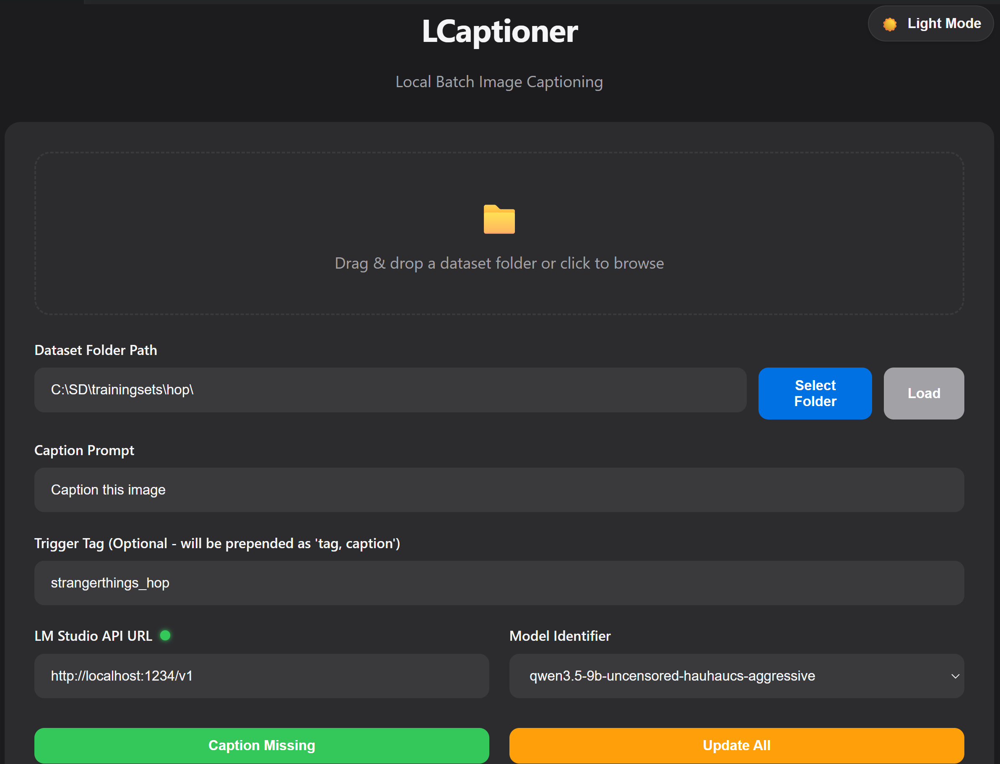
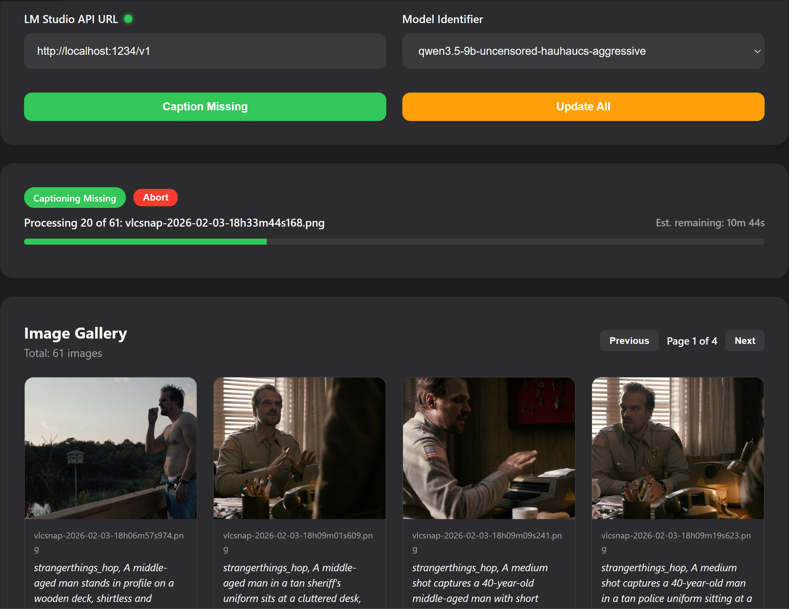

# LCaptioner

LCaptioner ("L" stands for light-weight, local or LMStudio-based) is a basic, local batch image captioning tool designed for the Pinokio ecosystem. It leverages local Large Language Models (LLMs) via OpenAI-compatible APIs (like LM Studio) to generate high-quality descriptions for image datasets, making it an essential tool for preparing training data for Stable Diffusion, Flux, or other vision-based models.

  
  

## 🚀 Features

- **Local LLM Integration**: Seamlessly connect to LM Studio, Ollama, or any OpenAI-compatible local API.
- **Smart Batch Processing**:
  - **Caption Missing**: Only process images that don't have an associated `.txt` file.
  - **Update All**: Refresh descriptions for every image in the folder.
- **Trigger Tag Injection**: Prepend custom trigger words (e.g., `ohwx`, `style of [name]`) to every caption automatically.
- **Real-Time Progress & ETR**: Track your progress with a visual progress bar, total time elapsed, and estimated time remaining.
- **Single Image Captioning**: Fine-tune your dataset by captioning or re-captioning individual images directly from the gallery.
- **Model Discovery**: Automatically fetches and lists available models from your connected LLM instance.
- **Abort Control**: Safely stop batch processes at any time without losing already saved captions.
- **Modern UI**: Clean, responsive interface with Dark and Light mode support.

## 📦 Installation

Since this is a Pinokio-ready application, installation is a one-click process:

1. Open your **Pinokio** browser.
2. Click on **Download** and paste the repository URL.
3. Once the repository is cloned, click **Install**. Pinokio will automatically set up the Node.js environment and dependencies.

## 🛠 Usage

1. **Launch**: Click **Start** in Pinokio to run the local server.
2. **Select Folder**: Use the **Select Folder** button to pick your dataset directory.
3. **Configure API**:
   - Ensure your local LLM server (e.g., LM Studio) is running and the **API URL** is correct.
   - The status indicator will turn **green** once a connection is established.
   - Select your desired vision-capable model from the **Model Identifier** dropdown.
4. **Set Prompt & Tags**: Enter your captioning prompt and an optional trigger tag.
5. **Caption**: Click **Caption Missing** or **Update All** to begin.

## 📝 API Integration

LCaptioner provides a simple internal API for interacting with the backend:

- `GET /api/images`: Retrieve paginated images and captions from a folder.
- `POST /api/caption`: Start a batch captioning stream (SSE).
- `POST /api/check-connection`: Verify LLM API availability and fetch models.
- `POST /api/caption-single`: Process a single image.

## 📝 Notes on LM Studio and local language model
Tested and working great with a local LM Studio (v0.4.6 with REST API v1) running different versions of Qwen 3.5 9B models. 

Used the following system prompt:

# Role
You are an expert image captioning assistant. Your goal is to provide highly detailed, natural language descriptions of images to be used for training FLUX family generative models.

# Task
Analyze the provided image and generate a single, cohesive paragraph (50–150 words) that describes the scene as if you are explaining it to a blind person with an interest in art and photography.

# Captioning Guidelines
1. **Natural Language Only**: Do not use comma-separated tags (e.g., "1girl, solo, blue hair"). Use full, descriptive sentences.
2. **Structure**: 
   - Start with the **Subject** (Who or what is the main focus?)
   - Describe the **Action/Pose** (What is happening?)
   - Detail the **Environment/Background** (Where is it?)
   - Describe **Lighting and Atmosphere** (Time of day, light source, mood).
   - Specify **Technical Aspects** (Camera angle, depth of field, art style like "oil painting" or "cinematic photography").
3. **Be Specific**: Instead of "a car," say "a vintage red 1960s sports car with chrome bumpers." Instead of "blue eyes," say "piercing sapphire blue eyes."
4. **Spatial Awareness**: Use words like "to the left," "in the background," "perched atop," or "framed by" to establish where objects are.
5. **Text Rendering**: If there is text in the image, describe it exactly using quotation marks: 'a neon sign that reads "OPEN" in a flickering red font'.
6. **Color Precision**: Mention specific colors and palettes (e.g., "muted earth tones," "vibrant neon pinks," or "a warm golden hour glow").

# Constraints
- Do not use "filler" words like "This is an image of..." or "We can see..."
- Start directly with the subject.
- Avoid buzzwords like "4k," "UHD," or "masterpiece." Use descriptive language to imply quality instead.
- If training a specific character/object, refer to them by a unique token provided in the user message (e.g., "ohwx man").

# Example Output
A close-up, waist-up shot of ohwx man standing in a crowded Tokyo street at night. He is wearing a weathered olive-green flight jacket over a black hoodie, looking off to the side with a contemplative expression. The background is a bokeh-blurred wash of colorful neon signs in Japanese kanji and the streaks of passing car lights. Cool blue ambient light hits the left side of his face, contrasted by a warm orange glow from a nearby ramen stall. The image has a cinematic, film-grain texture with a shallow depth of field.

Any ideas regarding functionality, fixes, improvements or changes to the this application, LLM model or system prompt suggestions are most welcome.  

